# raptor
## 任务调度系统

### 任务注册器

任务注册器实现在jobcenter包下的register中，主要提供任务的注册、修改以及查看功能。注册的接口由router提供。router提供对外的restfulAPI，供前端及调度器间的通信使用。

### 任务调度流程

调度的实现在jobcenter下的scheduler中，待完善

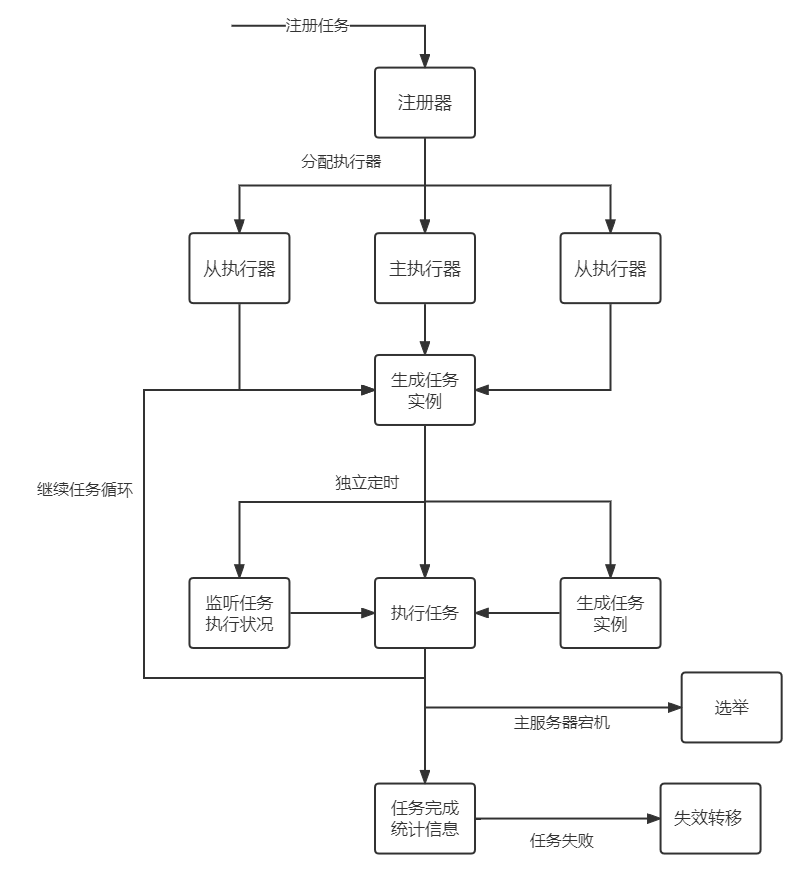

### 失效转移

失效转移实现在jobcenter下的failover中，待补充。

失效转移机制可在任务执行失败时，提供重新执行或延后执行等功能。正常情况下，执行失败的任务将直接由主服务器负责处理，从服务器由主服务器通知更新任务状态。主服务器宕机的情况下，从服务器将进行选举，得出新的主服务器之后进行失效转移流程。

#### 主从选举

主从选举是为了在主服务器宕机时保证存在合适的服务器接管任务的执行，拟使用raft算法，待实现。

**Raft算法**

采用 Raft 算法选举，集群节点的角色有 3 种：

- Leader，即主节点，同一时刻只有一个 Leader，负责协调和管理其他节点；
- Candidate，即候选者，每一个节点都可以成为 Candidate，节点在该角色下才可以被选为新的 Leader；
- Follower，Leader 的跟随者，不可以发起选举。

Raft 选举的流程，可以分为以下几步：

1. 初始化时，所有节点均为 Follower 状态。
2. 开始选主时，所有节点的状态由 Follower 转化为 Candidate，并向其他节点发送选举请求。
3. 其他节点根据接收到的选举请求的先后顺序，回复是否同意成为主。这里需要注意的是，在每一轮选举中，一个节点只能投出一张票。
4. 若发起选举请求的节点获得超过一半的投票，则成为主节点，其状态转化为 Leader，其他节点的状态则由 Candidate 降为 Follower。Leader 节点与 Follower 节点之间会定期发送心跳包，以检测主节点是否活着。
5. 当 Leader 节点的任期到了，即发现其他服务器开始下一轮选主周期时，Leader 节点的状态由 Leader 降级为 Follower，进入新一轮选主

### 任务依赖

任务依赖主要实现在dependence包中，包括两个部分：依赖任务的执行、任务执行前的定时。

#### 依赖任务原理

依赖任务即由多个具有先后关系子任务形成的任务，子任务之间的关系可由DAG图（有向无环图）表示。通过对DAG图的遍历实现依赖任务的执行。

##### 算法-卡恩算法

通过卡恩算法获取到DAG图的拓扑排序，以拓扑排序为标准进行子任务的执行。

卡恩算法具体如下：

1. 从有向图中选择一个没有前驱（入度为0）的点，输出它。
2. 从网（图）中删除它，并且删除从它出发的所有有向边。
3.  重复上面步骤，直到图（网）中不再存在没有前驱（入度为0）的点为止。

以下面的DAG图为例，按照卡恩算法则依次输出:

{1、2} ->{4}->{3}->{5}，其中每次输出中的任务可以并行执行，可以提高对多核计算机系统的利用率

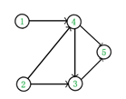

##### 具体代码

###### 依赖任务结构

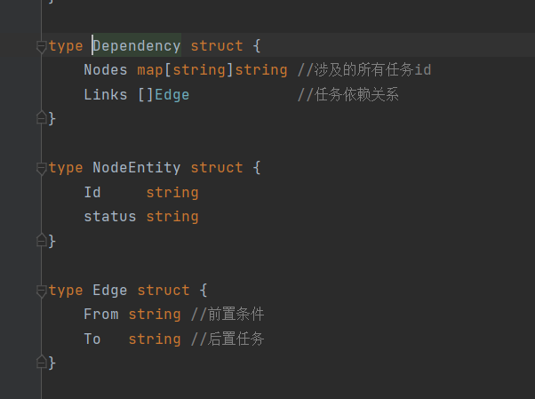

其中Nodes存储了所有的子任务ID及其状态（未执行、执行中、已执行），Links则是存储了依赖关系，From是前置任务，To为后置任务。通过Dependency结构体，可以获取到依赖任务的具体内容，以此来确定子任务执行顺序。

###### 获取入度为0的任务

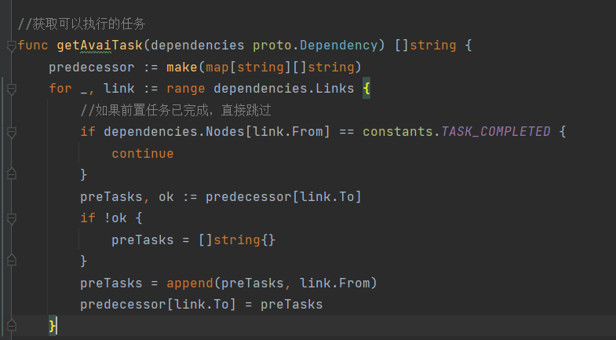

通过以上代码获取执行过程中，每个任务前置任务的状态。predecessor中key是每一个任务，value则是每一个任务所有未完成的前置任务。

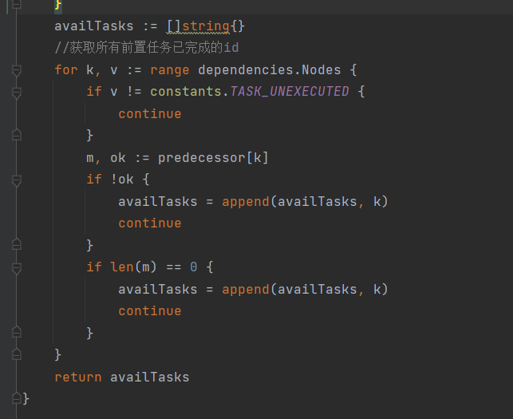

通过predecessor中每个任务的前置任务，如果为空，则代表其所有的前置任务已经完成，可以执行此任务。

###### 删除入度为0的节点及其所有边

由于需要监控依赖任务的执行状态，所以在代码中并没有对节点进行删除，而是通过设置任务状态来标志任务已经被执行。

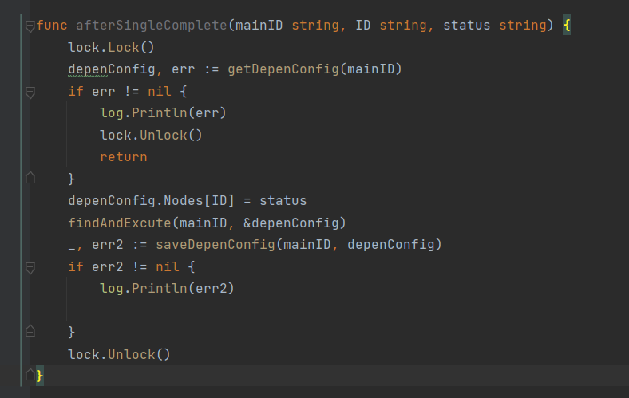

任务完成时通过传入status参数更新任务状态

###### 判断依赖任务中所有任务完成

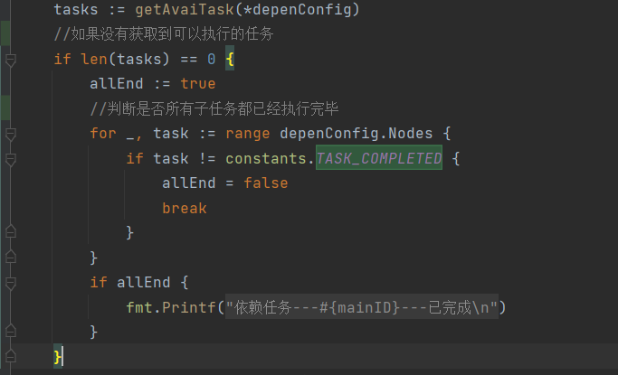

在获取可执行任务时，通过是否有可执行的任务、是否所有子任务已经执行完毕来判断整体任务是否完成。

#### 定时原理

定时任务代码主要在timewheel.go中，通过秒级时间轮进行定时任务的执行。

传入任务以及任务预计执行时间的时间戳，计算与当前时间的差值进行延迟执行。

##### 存在问题

如果任务执行时间与当前时间差值过大，大于时间轮的最大范围，如何进行定时？

在本系统中，采用了轮询的方式，通过设置循环任务，每隔一定时间，去查询未来近期内需要执行的任务，加入时间轮，以此来进行长延迟任务的执行。

##### 具体代码

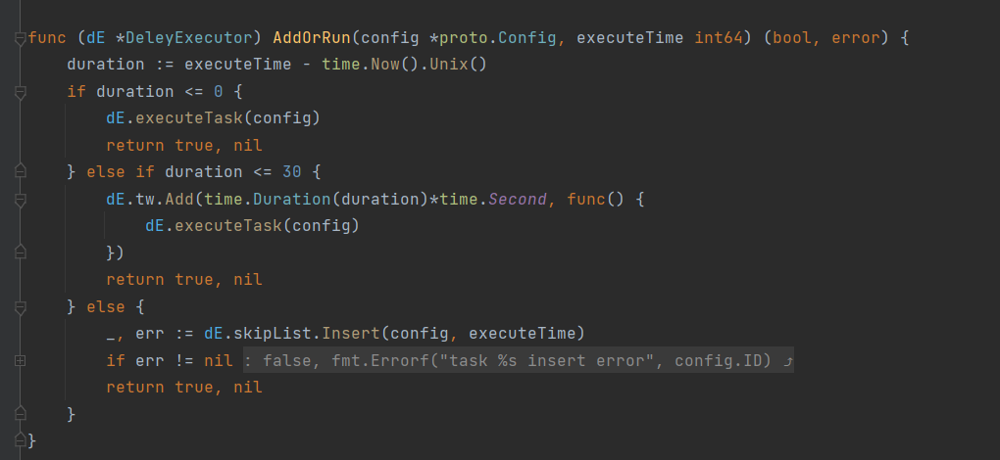

分为三个部分：

如果与当前时间插值小于等于0，则立即调用函数，执行此任务。

如果未来短时间内会执行，则加入到时间轮中，并设置回调函数

如果未来长时间内不会执行，则加入跳表中，通过循环任务加入时间轮

###### 循环任务代码

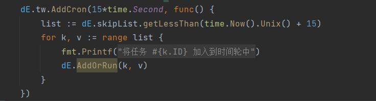

获取跳表中，未来一段时间将要执行的任务，加入时间轮

###### 选择跳表的原因

存储任务数量：在本系统中，由于存储的任务数量未知，所以采用数组不太合适

动作：需要获取一定时间内将要执行的任务，所以存储的任务需要按照时间戳进行排序

而跳表底层实现为链表，同时可以设置元素权重进行排序，因此跳表比较合适。整体上，跳表即带有索引结构的链表，对于插入查找删除都有较好的性能。但是由于索引结构的存在，舍弃了一部分存储空间来换取时间上的性能。

#### 任务分片

##### 任务分片流程

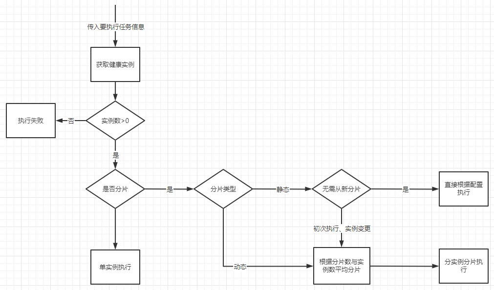

##### 动态分片

每次根据当前健康实例数目进行重新平均分片，不记录本次分片结果

##### 静态分片

将静态分片结果存储到任务配置信息中，之后每次正常调用直接使用已存在的静态分片结果，无需重新分片

（初次分片、静态分片失效转移、执行实例少于默认实例且健康实例数目足够 将触发重新分片）

###### 静态分片结果存储结构

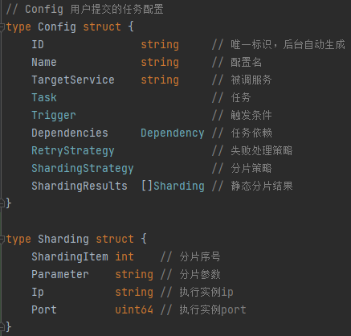

###### 静态动态分片选择

动态分片确保任务执行的可靠性，效率相比静态会低一些

静态分片不需每次重新分片，效率相对较高，但可靠性相对低

###### 分片策略

分片策略目前参考elastic-job的三种分片策略：

####### AverageAllocationJobShardingStrategy：基于平均分配算法的分片策略：

如果有3台服务器, 分成9片, 则每台服务器分到的分片是: 1=[0,1,2], 2=[3,4,5], 3=[6,7,8]

如果有3台服务器, 分成8片, 则每台服务器分到的分片是: 1=[0,1,6], 2=[2,3,7], 3=[4,5]

如果有3台服务器, 分成10片, 则每台服务器分到的分片是: 1=[0,1,2,9], 2=[3,4,5], 3=[6,7,8]

####### OdevitySortByNameJobShardingStrategy：根据作业名的哈希值奇偶数决定IP升降序算法的分片策略：

作业名的哈希值为奇数则IP升序. 作业名的哈希值为偶数则IP降序.然后再调用AverageAllocationJobShardingStrategy的平均分片算法进行分片

####### RotateServerByNameJobShardingStrategy：根据作业名的哈希值对服务器列表进行轮转的分片策略：

根据作业名的哈希值对服务器列表进行轮转.然后再调用AverageAllocationJobShardingStrategy的平均分片算法进行分片

#### 任务异步执行

##### 异步执行流程

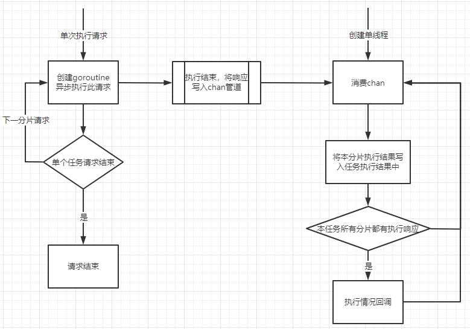

##### 异步执行

根据任务信息发起执行，分片完成后对应单个分片为单次执行，创建goroutine轻量级线程异步发起执行。主程序发起所有分片执行请求后调用结束

引入channel结构作为通信工具，也可视作简单的消息服务器，单次执行结束将结果写入channel。

开启一个单线程重复消费channel中的结果，并对结果判断是否单个完整任务都执行结束。若执行结束则回调返回结果，若任务未全部完成则拿取下一个分片执行结果

##### 异步执行存储结构

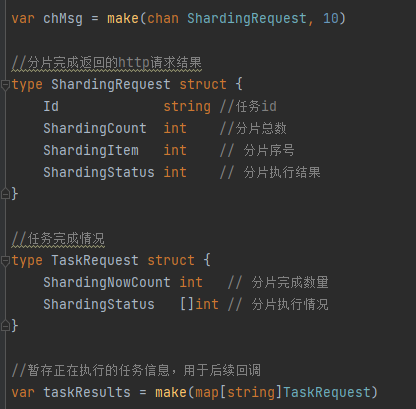

##### 异步执行消费channel

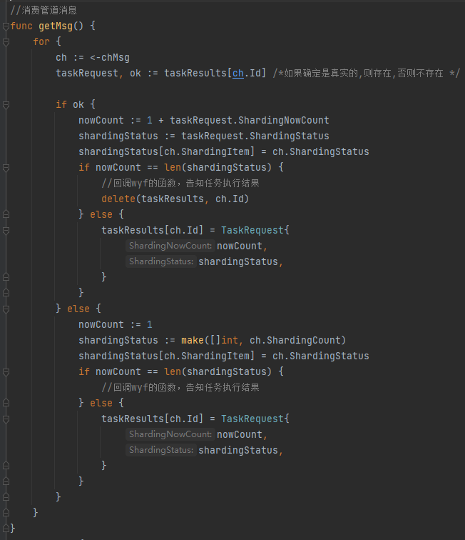

